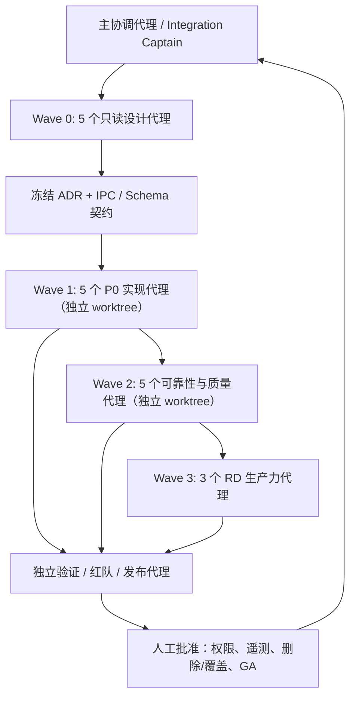

# AnalysisBuddy 代码完成度审计、功能缺口与多代理开发方案

**审计日期：** 2026-08-12  
**审计对象：** `AnalysisBuddy`（Rust + Tauri 2 + React + ECharts + JSON-RPC stdio 插件体系）  
**产品定位：** 面向 RD 团队工作站的模块化日志快速分析与可视化工具  
**关联体验报告：** [UI/UX 测试报告](./ui-ux-test-report-2026-08-12.md)  
**审计方式：** 需求基线核对、并行代码审计（前端 / Rust 核心与 IPC / 插件、SDK、交付链路）、本地测试和已存验收记录交叉取证。本报告未修改产品代码。

> **范围调整（产品负责人确认，2026-08-12）：** 当前阶段由同一受控主体独家提供、安装和更新所有插件；插件不会开放给非受控第三方供应商。因此，插件代码签名、企业 allowlist、证书撤销、供应链 provenance/SBOM 与面向多供应商的权限治理不作为当前版本的 P0/P1 交付门槛。本文仍保留相关风险作为未来“开放插件生态 / 多供应商分发”前必须重新启用的治理项。当前必须保留的底线是：ZIP 解压安全、安装目录边界、更新下载大小限制、子进程崩溃隔离、超时、取消和可诊断性。

---

## 1. 执行摘要

AnalysisBuddy 已经拥有一个扎实的**工程骨架**：插件协议、三源发现、独立子进程运行时、JSON-RPC 超时与熔断、归一化时序存储、LTTB 降采样、CSV 示例解析器、Python/.NET SDK、插件校验器、基础打包和真实插件 E2E 都已存在。

但对 RD 分析人员真正关键的闭环——“导入数据 → 选择指标 → 看图定位 → 保存分析上下文 → 以后可靠重开并继续分析”——尚未达到可交付标准。最明显的是，会话文件的接口模型支持保存指标、图表视图和游标，但当前保存命令主动把这些字段写为空；生产模式也没有打开 `.absession` 的文件选择入口。换言之，系统可保存“文件清单”，却不能可靠保存“分析工作”。

插件被设计为独立进程，这能隔离崩溃，却**不是安全沙箱**。不过，产品负责人已确认当前所有插件由唯一、受控供应商提供；因此本报告不把签名、第三方信任或供应链治理作为当前版本阻塞项。若未来向多团队/第三方开放插件安装或更新，必须重新启用该治理议题，不能把当前的单供应商假设沿用到开放生态。

### 1.1 就绪度判断

| 使用目标 | 判断 | 原因 |
|---|---|---|
| 核心技术验证 / 可信开发者本机试点 | **有条件可用** | 协议、导入管线、查询、示例插件与基础测试具备可验证实现 |
| 小范围 RD 团队日常分析 | **暂不建议作为唯一工具** | 会话重开、取消、数据完整性和生产 UI 闭环存在关键缺口 |
| 当前受控插件集的 RD 团队日常分析 | **P0/P1 修复后可试点** | 不以第三方插件信任为门槛；仍需完成会话、取消、数据完整性和真实 UI 验证 |
| 多团队自行安装第三方插件 | **暂不在当前范围；开放前需重新审计** | 当前单供应商假设不覆盖多供应商信任、权限和审计需求 |
| 内网 / 离线 / 受控工作站规模化部署 | **需按部署方式评估** | 若继续使用当前受控本地插件可先试点；内网更新和诊断能力仍是后续治理项 |
| 扩展到 >100MB 或实时日志 | **不在 v1 目标内** | `PLAN.md` 已明确排除；应在 v1 稳定后另立版本目标 |

### 1.2 完成度轮廓

以下评估表示“满足已冻结 v1 需求并可被 RD 用户稳定使用”的程度，而非代码行数或测试数量。

| 能力域 | 估计完成度 | 审计判断 |
|---|---:|---|
| 协议、manifest、插件发现与主机状态机 | 75% | 基础实现和规范较成熟，但兼容与信任模型不足 |
| 导入、解析、内存时序存储与查询 | 65% | 主路径完整；高吞吐背压、取消竞争、内存效率需要硬化 |
| CSV 内置解析器 | 65% | 可解析常见格式，但解码、内存和 key-values 采样策略不适合无边界扩展 |
| 工作台可视化与交互 | 55% | 图表、指标、游标已实现；窄窗口适配、状态清理和错误可见性不足 |
| 会话持久化与恢复 | 30% | 文件哈希校验与重解析存在；分析上下文没有真正保存/恢复 |
| 模块管理与更新 | 60% | ZIP 防护、启停、更新框架存在；当前重点是下载边界、回滚和 UX，第三方信任治理延期 |
| SDK / 插件开发者体验 | 65% | Python/.NET SDK、示例和 validator 已有；版本治理、企业模板和发布体系欠缺 |
| 自动化质量与发布运维 | 45% | 单元、E2E、性能基线、双架构脚本已有；PR 门禁、真实 UI E2E、制品可追溯性不足 |
| 当前受控插件的运行安全 | 55% | ZIP 防护、独立进程、超时和熔断存在；签名/多供应商治理按当前决策延期 |

**总体结论：** 这是一个“核心能力已可验证、产品闭环与企业化基础尚未完成”的 Beta/试点阶段项目，而非可直接扩散到多个 RD 团队的 GA 产品。

---

## 2. 需求基线与已实现能力

`PLAN.md` 的 v1 主线是：导入已有文件、由插件归一化为时序数据、叠加指标曲线、在时间 T 查看关键状态值，并保存/重新打开会话。实时 tail、远程日志、日志编辑和 >100MB 索引并不属于 v1。

### 2.1 已实现且值得保留的能力

| 领域 | 代码/文档证据 | 评估 |
|---|---|---|
| 统一插件协议 | [protocol-v1.md](./spec/protocol-v1.md) 固化 `initialize`、`load_file`、流式 `parse`、`schema`、`key_values`、取消、超时、重试和状态机 | 契约清晰，适合作为扩展基础 |
| 插件发现与优先级 | `core/ab-host/src/discovery.rs`：三源目录、直接子目录扫描、优先级与影子插件处理 | 符合便携/安装目录/用户目录的插件需求 |
| 插件进程可靠性 | `core/ab-host/src/spawner.rs`、`session.rs`、`rpc.rs`：独立子进程、stdio/RPC、stderr、超时、熔断、孤儿清理 | 对插件崩溃和协议问题有较好的隔离设计 |
| 数据存储与查询 | `core/ab-pipeline/src/store.rs`、`query.rs`、`lttb.rs` | 具备归一化记录、序列冻结、时间范围查询和降采样能力 |
| CSV 示例插件 | `plugins/builtin-csv/src/engine.rs` | 具备时间列识别、分隔符处理、流式批量返回、解析告警、低基数字段 key-values |
| 会话文件基本可靠性 | `core/ab-pipeline/src/session_file.rs` | 已有原子写、文件 SHA-256 校验、缺失/哈希变化检测和重开管线 |
| 工作台基础交互 | `ui/src/components/FilePanel.tsx`、`MetricTree.tsx`、`TimelineChart.tsx`、`KeyValuesPanel.tsx` | 文件导入、指标选择、图表查询、游标关键值和中英文/主题已存在 |
| 插件管理基础 | `core/ab-app/src/commands/plugin_manager.rs`、`ui/src/components/PluginManagerPage.tsx` | ZIP 安装、启停、卸载、日志、重载和 GitHub 更新框架已实现 |
| 开发者扩展能力 | `sdk/python/`、`sdk/dotnet/`、`tools/plugin-validator/`、`docs/developer-guide/` | SDK、示例、validator 与开发文档提供了实际扩展路径 |
| 基础交付与验证 | `.github/workflows/`、`tests/e2e/`、`tests/perf/`、`scripts/` | CI、真实插件 E2E、性能脚本、x64/ARM64 构建与 ZIP 验证均有基础设施 |

### 2.2 不应被“已存在代码”掩盖的完成度差异

| 容易产生的误判 | 实际情况 |
|---|---|
| “有 `.absession` 结构就代表会话可恢复” | 保存命令明确写入空的指标、图表状态与游标；恢复端也不重置旧工作台状态 |
| “插件独立进程就安全” | 进程隔离防止宿主崩溃，不限制文件、网络、环境变量和子进程能力 |
| “有前端单测就说明 UI 完整” | UI 测试主要是 jsdom/IPC mock；本次实际执行中有 3 个真实 ECharts 路径用例超时 |
| “有 release workflow 就代表 RD 可稳定试点” | 当前 workflow 上传 artifact，但 PR 前端门禁、真实 UI 回归、受控更新回滚与干净机验收尚未形成统一闭环 |
| “有 100MB 约束就表示内存风险受控” | CSV 插件仍会整文件读取、解码为字符串并保存关键值样本，宿主和插件间也存在数据副本 |

---

## 3. 高优先级完成度缺口

优先级的含义：

- **P0：** 阻止试点扩散或导致数据/安全/核心任务不可接受的风险；先处理。
- **P1：** 影响日常可信使用、数据完整性、可恢复性或可靠交付；试点前处理。
- **P2：** 影响规模化效率、兼容性、可诊断性或典型 RD 体验；按版本规划。
- **P3：** 质量债、易用性和长期效率改进；在核心闭环稳定后处理。

### P0-01 — 会话没有保存或恢复“分析上下文”

**影响：** 这直接违背产品最关键的 RD 工作流。用户无法可靠地保存已选指标、当前时间范围、图例状态、Y 轴策略和游标位置；之后即使重新解析了文件，也不能回到上次分析现场。对于复现性能回归、提交问题单、多人协作复盘，这会让会话文件的价值显著下降。

**代码证据：**

- `SessionFile` 已具备 `selected_metrics`、`chart_view_state` 和 `cursor_ms` 字段：`core/ab-pipeline/src/session_file.rs:31-61`。
- 保存组装函数却把它们硬编码为空或 `None`：`core/ab-app/src/commands/session.rs:171-184`，注释也承认 UI 状态“待扩展”。
- UI 的 `saveSession` 仅向 IPC 传 `{ path }`：`ui/src/state/session.ts:583-613`。
- UI 的 `openSession` 只追加缺失文件、占位文件和指标树；不恢复视图状态：`ui/src/state/session.ts:617-637`。
- `openSession` 也不先清理现有文件、选择、曲线、禁用集和关键值，连续打开两个会话会污染状态。

**修复目标：**

1. 将“会话快照”定义为前后端共同拥有的版本化 DTO，而不是仅传路径；
2. 保存时由 UI 提交选择、视图窗口、图例开关、Y 轴缩放和游标，Rust 只负责校验、原子写和数据文件哈希；
3. 加载时执行单次原子 reducer：先终止/清理旧会话，再装载新会话、恢复 snapshot、按已验证文件重解析；
4. 为缺失、哈希不匹配、重解析失败提供明确的可重试/跳过/重新定位文件流程；
5. 用真实 Tauri IPC + 真实插件验证“导入 → 选择两个指标 → 缩放 → 设置游标 → 保存 → 全新进程打开 → 状态一致”。

**验收：** `.absession` 内容包含上述状态；干净启动后的 UI 状态与保存前一致；失败文件只影响自身，不混入旧会话；连续打开会话不会残留旧曲线或关键值。

### P0-02 — 用户无法从正式界面取消长时间解析

**影响：** `PLAN.md` 和协议已定义 `cancel_parse`，但真实 Tauri 调用和 UI 入口没有接通。对 RD 用户而言，选错 100MB 文件、碰到异常插件或解析时间过长时，只能等待或退出应用；这不符合“快速分析工具”的基本预期。

**代码证据：**

- 协议已有取消语义：[protocol-v1.md §3.4](./spec/protocol-v1.md#34-cancellation-semantics)。
- `ImportCoordinator` 已实现 `cancel_parse`：`core/ab-app/src/pipeline_bridge.rs:368-384`。
- Tauri `invoke_handler` 注册列表未包含 `cancel_parse`：`core/ab-app/src/lib.rs:111-127`。
- 前端 IPC 接口也没有取消方法：`ui/src/ipc/ipc.ts:24-25` 附近。

**修复目标：**

1. 新增 `cancel_parse(file_id)` Tauri command、ACL 项和 UI IPC 方法；
2. 为每个文件引入明确的 `ImportJob` 所有权、generation/operation id、取消令牌和任务 join；
3. 按钮只在 `parsing` 状态显示，点击后即时进入“正在取消”，最终只能落在一个终态；
4. 取消后丢弃半成品记录，并保证旧解析任务不能再将状态改回 `ParseFailed` 或 `Ready`；
5. 记录耗时、取消原因和插件响应结果以便诊断。

**验收：** 用户操作后有即时反馈；在约定时间内收到取消完成或超时错误；重复取消幂等；取消与卸载/关闭/重开并发时没有脏数据、重复事件或状态倒退。

### 延期治理项 — 多供应商插件信任与可验证供应链

**当前决策：** 不作为当前版本 P0/P1。产品负责人确认现阶段唯一、受控供应商提供全部插件，因此可以把签名、证书撤销、企业 allowlist、SBOM/provenance、对外 Release 资产和多供应商权限治理从本周期移出。

**仍应记录的边界：**

- 子进程入口会继承宿主环境：`core/ab-host/src/spawner.rs:27-44`；独立进程不是安全沙箱。
- ZIP 安装已有容量、条目、zip-slip 和解压量防护：`core/ab-app/src/commands/plugin_manager.rs:33-43`、`218-284`；这些安全检查应保留。
- 当前安装/更新不做签名或校验和验证；这在“唯一受控供应商”前提下可以接受，但一旦允许他人提供插件、通过共享目录复制插件，或让用户自行下载 ZIP，就必须重新升级为 P0。

**重新启用条件：** 出现任一情况时，主协调代理必须创建新的安全 ADR，并将信任/供应链工作重新放回 P0：

1. 第二个插件供应商或跨团队独立插件仓库出现；
2. 用户可自行从 URL、共享盘、聊天附件或外部 Git 仓库安装插件；
3. 插件需要读取超出用户主动导入文件范围的数据、访问网络或使用敏感凭据；
4. 产品开始跨组织、跨受控工作站或对外分发。

---

## 4. P1：可靠性、数据完整性与试点门槛

### P1-01 — 高吞吐解析路径会静默丢弃批次

**影响：** 宿主桥接把插件批次写入容量为 256 的 channel；channel 满时使用 `try_send` 并丢弃消息，仅增加私有计数。协调器没有将丢失计数转换为错误或背压。高吞吐、合法插件可能因此丢掉记录，最后表现为 `CountMismatch` 或分析结果失败；更糟糕的是，用户无法知道是插件坏了还是宿主背压策略丢了数据。

**代码证据：**

- 静默丢弃逻辑：`core/ab-app/src/host_bridge.rs:81-89`。
- channel 由导入流程创建：`core/ab-app/src/pipeline_bridge.rs:655-681`。
- parse 完成后仅靠 `freeze(records_total)` 间接发现计数问题：`pipeline_bridge.rs:682-742`。

**修复建议：**

- 解析数据通路采用 `send().await` 的显式背压，而不是丢弃；
- 若必须限流，取消本次解析并明确返回 `host_backpressure`，不能静默继续；
- 将每个 import job 的 `received_batches`、`dropped_batches`、records、延迟和 channel 高水位纳入结构化诊断；
- 添加 100MB / 高批次率压力测试，证明结果记录数和协议 `records_total` 精确一致。

### P1-02 — 当前取消实现与活跃 parse 任务存在竞争风险

**影响：** 即使补上 UI command，当前 `cancel_parse` 调用插件后会立即清除 Store/索引；而原 parse task 仍可能继续返回并写入后续事件。这可能导致取消后出现错误状态覆盖、重复清理、同一 file id 的事件乱序或不一致。

**代码证据：**

- 取消路径直接 unload：`core/ab-app/src/pipeline_bridge.rs:368-384`。
- 解析任务在独立 sink/await 路径继续处理：`pipeline_bridge.rs:655-742`。

**修复建议：** 将 import 重构为“每文件一个 job 状态机”；所有事件都携带 operation/generation id，状态转换由单一所有者序列化；取消必须等待 join 或把旧 generation 的事件视为过期并丢弃。

### P1-03 — 生产模式无法通过 UI 打开会话，且加载会污染旧状态

**影响：** `TopBar` 的“会话路径 + 打开会话”只在 mock 模式渲染。真实模式只有另存为对话框，没有打开 `.absession` 的原生选择器。即使通过其他方式调用 load，旧曲线和关键值也可能残留。

**代码证据：**

- mock-only 打开入口：`ui/src/components/TopBar.tsx:67-84`。
- `real.ts` 有 `pickSavePath`，没有 `pickOpenSession`：`ui/src/ipc/real.ts:35-70`。
- 加载不先执行完整 session reset：`ui/src/state/session.ts:617-637`。

**修复建议：** 将“打开会话”作为正式 top-bar 主动作，新增 `.absession` 文件选择器、加载中/错误/缺失文件导引和原子 state replacement；该工作必须与 P0-01 一起交付。

### P1-04 — 选择变化后旧曲线/关键值可能残留

**影响：** 取消最后一个指标、卸载文件或禁用文件时，查询 effect 直接 `return`，不会清空 `series`；游标变空或无 ready 文件时，也不会清空 key-values。这会让 UI 显示已经不属于当前会话的曲线或状态值，影响分析结论可信度。

**代码证据：**

- 指标或文件为空时直接返回：`ui/src/state/session.ts:444-469`。
- 游标/文件为空时直接返回：`ui/src/state/session.ts:471-493`。

**修复建议：** 在 reducer 中明确“选择集/文件集/cursor 失效即清空派生数据”的规则；请求结果必须按 generation 校验，避免晚到响应复活旧数据；加回归测试覆盖“全不选、卸载、禁用、打开新会话、取消导入”。

### P1-05 — 更新下载的实际大小没有强制上限

**影响：** 更新代码只在响应有 `Content-Length` 时预检 500MiB；分块下载时没有累计实际字节数。攻击者或错误服务器可使用 chunked/no-length 响应写满磁盘，然后才进入 ZIP 安装校验。

**代码证据：** `core/ab-app/src/network/update_fetcher.rs:167-168`、`225-258`。

**修复建议：** 流式累计字节，超过上限立即中止并删除临时文件；限制重定向、强制 HTTPS 最终地址、校验 content type、用随机临时文件和 `fsync`，再完成 ZIP 结构、manifest、版本与原子替换校验。测试必须覆盖无/伪造 `Content-Length`、重定向、断网、磁盘满和取消。

### P1-06 — 前端真实渲染测试未全绿，CI 又没有把前端测试作为必经门禁

**实际执行证据（本次审计）：**

| 命令 | 结果 |
|---|---|
| `cargo test -p ab-pipeline -p ab-app --lib` | 通过：45 个 `ab-app` 单元测试通过 |
| `npm run typecheck` | 通过 |
| `npm run check:i18n` | 通过：中英文 key 树一致，共 147 keys |
| `npm test -- --run` | **失败：159 个测试中 156 通过，3 个真实 ECharts 路径测试在 5 秒超时** |

超时的用例为：

- `ui/src/components/real-import-flow.test.tsx`：真实 DTO 导入、指标、图表工作流；
- `ui/src/components/viewport-fit.test.tsx`：导入后按数据范围适配视口；
- `ui/src/components/cursor-zr-click.test.tsx`：zrender 点击设置游标并触发 key-values。

这不等同于“3 个产品功能已确认损坏”，但足以证明关键真实渲染路径当前没有稳定的自动化验证，不能宣称 UI 测试全绿。

**CI 证据：**

- `.github/workflows/ci.yml:25-53` 构建 UI、构建 Rust、运行 cargo tests，但未运行 `npm test` 或 `npm run check:i18n`；
- `.github/workflows/lint.yml:22-43` 运行 ESLint 和 TypeScript，但未运行前端单测；
- 三个主 workflow 当前主要监听 `push main` / tag / 手工，而不是 pull request。

**修复建议：** 先定位并修复超时根因（避免仅放宽 timeout）；为前端设置 PR required check；增加桌面/浏览器级 E2E、截图回归与真实 Tauri IPC 合约测试；将失败截图、控制台和 trace 作为 CI artifact。

---

## 5. P2：性能、可诊断性、兼容性与企业部署缺口

### P2-01 — 内置 CSV 插件的内存与解码策略不适合“快速”目标的边界场景

**问题：** `load_file` 阶段把完整文件读入内存、解码成完整 `String`，随后 `parse_file` 再遍历该字符串。单文件虽然被限定为 ≤100MB，但在插件侧原始字节、解码字符串、解析缓冲、key-values 样本和宿主归一化记录可能同时存在，实际峰值远高于原始文件大小。

**代码证据：**

- `Encoding::Auto` 直接走有损 UTF-8：`plugins/builtin-csv/src/engine.rs:66-105`；
- 解析遍历保留的完整 `lf.content`：`engine.rs:470-574`；
- `key_values` 为每个最终低基数字段逐行存 `(timestamp, String)`：`engine.rs:546-560`。

**建议：**

1. 用 reader/byte stream 处理 CSV，避免长期保留完整 decoded string；
2. `Auto` 至少可靠识别 UTF-8 BOM/UTF-16 BOM，并对可选 GBK 使用可解释检测；无法确定时显示编码选择而不是静默乱码；
3. key-values 使用每列压缩状态片段、时间分段、上限或采样策略，而不是保存所有重复字符串；
4. 为 10/50/100MB、不同编码、长行、极多 key-values 列建立峰值 RSS 和吞吐基线；
5. 仅在达成 v1 稳定闭环后评估 sidecar/列式传输，避免过早上复杂 v1.1 设计。

### P2-02 — load_file 重试实现与文档策略不一致

注释声称“最多 2 次重试，退避 1s/3s”，但循环仅遍历两个元素，即初始尝试 + 一次重试；3 秒分支不可达。

**证据：** `core/ab-app/src/pipeline_bridge.rs:574-597`。

**建议：** 明确“总尝试次数”与“重试次数”的语义，写测试锁定 3 次总尝试和 1s/3s 行为，避免注释与实际治理策略漂移。

### P2-03 — 缺少跨层结构化诊断与支持闭环

现有实现可以缓存插件 stderr（`core/ab-app/src/events.rs` 的日志缓冲）和健康摘要，但没有跨层 session 级结构化日志、轮转本地日志、可审阅诊断包、性能指标、故障运行手册或隐私策略。遇到格式漂移、解析慢、磁盘不足或插件崩溃时，RD 支持人员很难快速判断问题所在。

**建议：**

- 本地结构化、轮转日志：`session_id`、文件 hash、插件 id/version/source、宿主版本、耗时、记录数、丢批数、RSS、错误码；
- 默认不上传遥测；导出前让用户审阅并脱敏诊断包；
- 提供 runbook：收集 → 分级 → 禁用/回滚插件 → 恢复会话 → 升级；
- 将性能/资源预算纳入插件健康页，而不只显示 stderr 文本。

### P2-04 — 插件兼容性、内网更新与 ARM64 承诺需治理化

| 缺口 | 证据 | 建议 |
|---|---|---|
| 兼容策略只检查最低协议和 host tools | `core/ab-host/src/manifest.rs` 的版本校验；Python/.NET SDK 均为 0.1.0 | 定义 host / protocol / SDK 兼容矩阵、最大协议、能力协商、弃用窗口和黄金契约 fixture |
| 更新固定 GitHub Releases | `core/ab-app/src/network/update_fetcher.rs` 的 GitHub fetcher；开发文档同样以 GitHub 为唯一源 | 若当前唯一供应商直接维护版本，可暂不扩展；当进入内网、离线或多团队部署时，再抽象 `UpdateSource` 支持内部 registry、静态 catalog、代理/自定义 CA 与离线 ZIP |
| ARM64 发布可以降级跳过 ZIP | `.github/workflows/release.yml` ARM64 路径可 ci-only；README 同时描述双架构交付 | 要么明确 ARM64 为实验性且不承诺发布，要么配备 required runner/硬件 smoke，未通过不得标记 GA |

---

## 6. P3：UI/UX 与开发体验债务

详细体验问题见关联 UI/UX 报告；以下问题应在 P0/P1 后处理：

1. 窄窗口 390px 下出现约 792px 的页面水平溢出，三栏工作台不适合分屏、高缩放和远程桌面；
2. 插件卸载没有确认、撤销或结果反馈，属于破坏性操作 UX 风险；
3. 拖拽区缺少完整的键盘语义与显式的等价选择文件入口；
4. 多个工具栏和插件操作按钮约为 24–26px / 12px 字号，触达性偏弱；
5. `AppShell` 初始 `list_plugins()` 未 catch：`ui/src/components/AppShell.tsx:33-35`；
6. ECharts 初始化、点击、setOption 和 dispose 异常目前主要 `console.error`：`ui/src/components/TimelineChart.tsx:94-140`，用户不可见，需纳入统一错误提示/诊断。

SDK 方面，Python 和 .NET 具备基础示例和单测，但缺少：清晰的内部消费渠道、SDK changelog/迁移指南、兼容矩阵、性能/错误恢复模板。`.NET` 项目也未启用面向公共 API 的 XML 文档生成。

---

## 7. 面向 RD 工作流的功能路线：先闭环，再扩展

下面的路线刻意区分“已冻结 v1 的缺陷修复”和“对 RD 更有价值的新能力”，避免把 v1 稳定性问题与功能扩张混在同一批次。

### 7.1 Release 0：可信 v1 闭环（必须先完成）

目标是让一次分析可以可靠完成、保存、重开、复现和诊断。当前受控插件模型下，不把多供应商信任体系作为该版本目标。

- 会话 snapshot 的完整保存与恢复；
- 生产模式“打开会话”、缺失文件处理、会话替换；
- 导入任务取消、状态机、无数据丢失背压；
- 前端派生状态清理、真实渲染测试稳定化；
- ZIP 安装/更新的容量边界、错误提示和回滚体验；
- PR 门禁、x64 干净机验收和可诊断性。

### 7.2 Release 1：RD 日常分析效率（在 v1 稳定后）

这些能力不属于当前最小 v1，却对 RD 调试、性能回归和跨日志对比具有高价值：

| 能力 | 用户价值 | 首选实现方向 |
|---|---|---|
| 多次运行对比与时间对齐 | 对比基线/回归、定位差异 | 会话中引入 run group、相对时间轴和手动锚点，不改变原始时间戳 |
| 派生指标与单位规范化 | 减少手工计算 | 插件 schema 扩展可选单位/维度；宿主侧受控表达式或插件侧计算，禁止任意脚本 |
| 注释/事件标记 | 将现象与日志上下文连接 | 先做本地 session annotations；可选消费现有 `annotate` 能力 |
| 可复现导出 | 方便问题单与评审 | 导出图表 PNG/SVG、选定窗口 CSV、会话摘要 Markdown；默认脱敏路径 |
| 高级过滤/搜索 | 快速定位异常区间 | 指标、tag、阈值、事件过滤；清晰的查询成本与空状态 |
| 分析模板 | 固化团队诊断手册 | 保存一组指标、轴、颜色、阈值、注释规则；模板按插件/工具版本管理 |

### 7.3 Release 2：企业化与规模化

- 企业插件 catalog、审批、灰度、回滚和版本钉死；
- 离线/内网更新源、代理、自定义 CA；
- 本地诊断包、隐私规则、支持 runbook；
- ARM64 真实设备门禁；
- 100MB 以上数据的独立架构评审（流式、索引、sidecar、缓存），不应在 v1 缺陷修复中暗中引入。

---

## 8. 后续开发方案：高能力模型的多子代理并行执行

用户要求的执行模型是：主模型应积极调度多个子代理，以高并发完成设计、实现、审计和验证。这个目标可行，但前提是把“并发研究”与“并发写同一文件”严格区分。最有效的方式不是让所有代理直接改共享工作区，而是让主协调代理将工作切成有契约、有文件所有权、有验收命令的 worktree 工作包。

### 8.1 组织模型



### 8.2 必须遵守的并行规则

1. **主协调代理是唯一的集成者。** 它负责需求裁决、依赖图、契约冻结、rebase、冲突处理、全量验证和最终发布判断；实现代理不得自行合并他人分支。
2. **每个写入任务使用独立 git worktree 和分支。** 禁止多个代理直接在同一共享工作目录改代码。分支名采用 `audit-fix/<wave>-<lane>-<topic>`。
3. **每个工作包必须预先声明四件事：** 输入契约、输出契约、允许修改的文件白名单、验收命令。若要触及未授权文件，代理必须先向协调代理申请。
4. **共享契约先冻结再编码。** `ipc.ts`、Rust command DTO、`SessionFile`、manifest schema、i18n key 和 CI workflow 都属于高冲突面；先由契约代理提交 ADR / fixture / snapshot，再交给消费者实现。
5. **TDD 与可复现证据。** 每项实现先提交失败测试或明确的 harness，再实现；最后提交最小可回滚 commit、测试输出、已知未测项和风险。
6. **只读任务最大化并行，写入任务按文件域并行。** 威胁建模、性能剖析、测试设计、文档梳理可以同时开 6–10 个代理；同一 Rust module、同一 UI state 文件、同一 workflow 文件在同一波次只能有一个写入 owner。
7. **跨域改动通过“契约 PR”传递。** 例如会话 DTO 先由契约代理合并；Rust 保存/加载、UI reducer、测试代理随后各自在明确接口上工作，不能各自改字段名。
8. **独立验证不能复用实现代理。** 至少一个代理只做黑盒、对抗和回归测试，避免实现者验证自己的假设。
9. **需人工批准的动作不得由子代理自行决定。** 包括扩大插件权限、上传遥测/诊断包、执行外部更新、删除/覆盖用户插件，以及正式发布制品。
10. **容量策略。** 若主模型拥有 10–14 个并发槽位，按下文完整波次启动；若平台仅提供 3–4 个槽位，仍按同一依赖图分批运行，优先让一批代理完成只读设计和契约测试，避免为了“并行”牺牲隔离性。

### 8.3 Wave 0：并行设计与证据冻结（5 个只读子代理）

此波次不改产品代码。每个代理输出一页 ADR 草案、风险清单、接口建议和验收案例；主协调代理整合后冻结接口。

| 代理 | 任务 | 输出 |
|---|---|---|
| D0-Session | 会话 snapshot / load 原子性设计 | 版本化 DTO、状态迁移、恢复/失败 UX 契约 |
| D0-Import | 导入 job、背压、取消、事件次序设计 | `ImportJob` 状态机、operation id、吞吐/取消验收 |
| D0-Release | 受控发布、更新回滚与干净机验收设计 | 版本清单、回滚流程、试点/GA 门禁 |
| D0-QA | 测试金字塔与真实 E2E 设计 | PR matrix、Tauri E2E、对抗/性能案例 |
| D0-RD-UX | RD 任务流、对比/导出/模板优先级 | Release 1 功能 PRD、避免 scope creep 的切分 |

**Wave 0 的唯一合并物：** `docs/adr/` 下的 ADR、JSON fixture、状态机图和一份已审批的 interface ledger；不合并任何业务实现。

### 8.4 Wave 1：P0 基础实现（5 个写入子代理）

以下任务以独立 worktree 执行。主协调代理只在 Wave 0 契约冻结后派发。

| Lane | 工作包与 owner | 文件域白名单 | 依赖 | 最小验收 |
|---|---|---|---|---|
| W1-A | 会话 DTO、保存/加载状态与兼容迁移 | `core/ab-pipeline/src/session_file.rs`、`core/ab-app/src/commands/session.rs`、对应 Rust tests | D0-Session | Rust snapshot / migration / atomic write tests |
| W1-B | 前端会话恢复与生产打开入口 | `ui/src/ipc/*`、`ui/src/state/session.ts`、`TopBar.tsx`、相关 tests/i18n | W1-A 接口 | 真实 IPC mock + reducer + 重新打开状态 E2E |
| W1-C | 导入取消 command、job 所有权与终态竞争消除 | `core/ab-app/src/commands/import.rs`、`pipeline_bridge.rs`、`lib.rs`、IPC contract tests | D0-Import | cancel / unload / close / retry 并发矩阵 |
| W1-D | 无损背压与批次完整性 | `core/ab-app/src/host_bridge.rs`、`pipeline_bridge.rs`、性能/E2E tests | D0-Import、W1-C 契约 | 高吞吐无丢批、records_total 精确匹配 |
| W1-E | PR CI、真实 UI 验证和 x64 试点验收 | `.github/workflows/`、`ui/` tests、`tests/e2e/`、验收 docs | D0-QA | 3 个超时用例稳定通过；PR 门禁；干净机走查 |

**冲突规则：** W1-A 是唯一可修改会话 schema 的代理；W1-B 只能消费冻结 DTO，不能改 Rust schema。W1-C 是唯一可修改导入 command 与 job 接口的代理；W1-D 在 W1-C 的 job 契约合并后追加 `pipeline_bridge.rs` / `host_bridge.rs` 改动。W1-E 是唯一可修改 CI workflow 的代理。

### 8.5 Wave 2：可靠性与质量门禁（5 个写入子代理 + 1 个独立验证代理）

| Lane | 工作包 | 文件域白名单 | 依赖 | 验收 |
|---|---|---|---|---|
| W2-A | 前端派生状态、错误呈现与真实图表测试稳定化 | `ui/src/state/session.ts`、`TimelineChart.tsx`、`AppShell.tsx`、UI tests | W1-B | 三个超时用例稳定通过；卸载/禁用/无选择无残留 |
| W2-B | 有界下载、原子更新和回滚可靠性 | `core/ab-app/src/network/`、`plugin_manager.rs`、tests | D0-Release | 无长度下载、断网、空间不足、版本错误和回滚 |
| W2-C | CSV 内存、编码和 key-values 资源预算 | `plugins/builtin-csv/`、perf fixtures/tests | D0-Import | 10/50/100MB 峰值 RSS、吞吐、编码与采样测试 |
| W2-D | SDK/validator matrix 与开发者回归 | `sdk/`、`tools/plugin-validator/`、CI docs | D0-QA | Python/.NET/示例插件/validator 兼容矩阵通过 |
| W2-E | 可观察性、诊断包与 runbook | `core/ab-app/src/events.rs`、诊断 docs/tests | D0-QA | 本地结构化诊断、无敏感上传、支持包 smoke |
| W2-V | 黑盒集成验证（不写业务实现） | 独立 tests/worktree | W1-A~E、W2-A~E | 取消、背压、更新、会话重开、性能和可访问性端到端报告 |

**特别说明：** W1-C 和 W1-D 都会涉及 `pipeline_bridge.rs`，所以不能同时写。推荐顺序是 W1-C 先完成并合并 job 契约，W1-D 再追加；W2-A 只修改 UI，W2-B/C/D/E 可并行。

### 8.6 Wave 3：RD 生产力功能（3 个并行子代理）

仅当 Wave 1/2 的 P0/P1 门禁通过后启动。

| Lane | 工作包 | 主要价值 | 约束 |
|---|---|---|---|
| W3-A | 多运行对比、相对时间对齐、分析模板 | 性能回归对比 | 不改原始 timestamp；会话 schema 变更须新 ADR |
| W3-B | 导出、注释、事件标记 | 问题单和复盘可复现 | 默认脱敏，导出明确标示数据来源/窗口 |
| W3-C | 诊断包、管理员 runbook、企业 catalog UX | 支持与运维闭环 | UI 只消费稳定 IPC DTO，不自行改变信任策略 |

### 8.7 Wave 4：集成、红队与发布（2 个独立角色）

| 角色 | 职责 | 通过条件 |
|---|---|---|
| Integration Captain | 合并所有小 commit、解决契约冲突、执行全量测试、维护 release candidate | 无未声明的 schema 漂移；所有 required checks、性能基线、回归报告通过 |
| Red-team / Release Captain | 干净 x64/ARM64、离线/代理、升级/回滚、受控 ZIP 边界、可访问性 smoke | P0/P1 验收全部通过；发布清单、受控更新流程和人工签核齐全 |

### 8.8 每个工作包的交接模板

每个子代理结束时必须以同一格式交接，防止“大模型多开代理”变成无法集成的文本输出：

```markdown
## Work package handoff

- Branch / worktree:
- Scope and owned paths:
- Contract consumed / produced:
- Commits (ordered):
- Tests executed with exact output summary:
- Evidence artifacts (screenshots, traces, benchmark, fixture):
- Known limitations / follow-up risks:
- Merge notes (conflicts expected, required ordering):
```

---

## 9. 分阶段验收门禁

| Gate | 目标 | 必须满足的证据 |
|---|---|---|
| G0 — 契约冻结 | 消除多人并行的接口漂移 | ADR 已批准；Session/IPC/manifest fixture 和兼容测试已提交 |
| G1 — P0 会话与导入闭环 | 可信保存、恢复、取消和无损解析 | 会话 E2E；取消竞争矩阵；高吞吐无丢批测试；生产打开会话验证 |
| G2 — P1 可靠性 | 可稳定试点、可诊断 | 前端真实测试全绿；PR 门禁生效；有界下载/回滚测试；本地诊断包 smoke |
| G3 — RD 试点 | 真实工作站可完成分析任务 | 干净 x64 机器：导入 → 图表 → key-values → 保存/重开；至少一个真实私有插件按企业信任策略安装 |
| G4 — 当前受控插件 GA | 可扩散、可回滚、可支持 | x64 验收、支持 runbook、ARM64 策略、受控更新/回滚流程已签核；若开放多供应商插件，另行补充签名与供应链门禁 |

在 G1/G2 未通过前，不建议把多运行对比、实时 tail、远程日志或 >100MB 支持作为并行实现目标；它们会扩大契约、性能和运维面，却无法解决当前最影响 RD 使用的可信闭环问题。

---

## 10. 审计验证与局限

### 10.1 本次实际执行的验证

| 验证 | 结果 | 说明 |
|---|---|---|
| `cargo test -p ab-pipeline -p ab-app --lib` | 通过 | `ab-app` 45 项库测试通过；不等同于全 workspace release 或桌面 E2E |
| `npm run typecheck` | 通过 | TypeScript 编译检查通过 |
| `npm run check:i18n` | 通过 | 147 个中英文 key 一致 |
| `npm test -- --run` | 失败 | 159 项中 156 通过，3 项真实 ECharts/导入路径测试超时，见 P1-06 |
| 本地浏览器 UI 测试 | 完成 | 语言/主题/插件启停与空状态通过；窄屏、卸载确认、可访问性问题已记录在关联报告 |

### 10.2 依赖已有证据、未在本轮重跑的部分

- 仓库已有的真实插件 E2E、性能基线、x64 打包 smoke 和 ARM64 降级验收记录参考 `tests/e2e/`、`tests/perf/`、`docs/release-acceptance.md`；本轮未完整重跑 release 全量矩阵。
- 本轮没有在真实企业 CA、代理、离线内网、ARM64 真机或受 WDAC/AppContainer 策略控制的机器上运行。
- 本轮审计没有上传数据、安装外部插件、发布制品或修改任何产品源代码。

---

## 11. 最终建议

建议将下一周期命名为 **“AnalysisBuddy v1 Analysis Closure”**，而不是立即开展更多数据源或更大规模数据能力。

优先顺序应为：

1. **会话保存/恢复 + 正式打开会话**；
2. **取消、无损背压和解析 job 状态机**；
3. **真实 UI E2E、PR 门禁和诊断闭环**；
4. **完成小范围 RD 试点后，再做对比、导出、模板等生产力功能。**

多供应商插件信任、签名与供应链能力不被删除，而是作为明确的**未来触发式治理项**保留：当产品边界从“唯一受控供应商”变为“允许他人供给或用户自行安装”时，必须在开放前恢复为 P0，不应以当前假设绕过该审计。

这样既保留当前插件化架构的优势，也能让 AnalysisBuddy 从“可展示的工程骨架”变为“RD 团队能信赖、能复现、能支持的工作站分析工具”。
