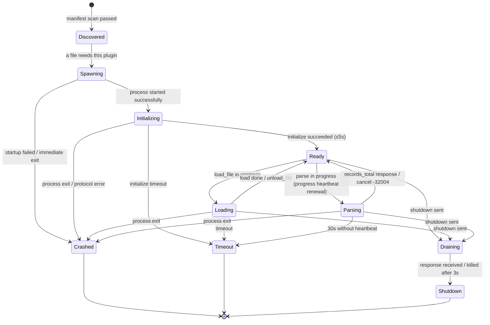

# AnalysisBuddy Plugin Protocol v1

> Status: **Frozen** (contract-v1).
> This English specification is the documentation artifact of the AnalysisBuddy plugin contract and the fact source for the `ab-protocol` Rust types, the contract validator (`plugin check`), and all SDKs. It is a field-for-field English mirror of the Chinese design document `AnalysisBuddy-devdocs/deep-dive/protocol.md` (sections 1–9); the design document remains the normative design source, and this specification introduces no field that is absent there.
>
> Keywords: MUST, MUST NOT, REQUIRED, SHALL, SHALL NOT, SHOULD, SHOULD NOT, MAY — per RFC 2119. "Host" means the AnalysisBuddy application; "plugin" means a plugin subprocess.

## 1. Transport and Framing

### 1.1 Transport Channels

| Channel | Use | Constraint |
|---------|-----|-----------|
| stdin / stdout | Protocol traffic exclusively. The host writes requests to the plugin's stdin; the plugin writes responses and notifications to its stdout. | Any non-protocol content (debug prints, progress bars) MUST NOT appear on stdout. |
| stderr | Plugin logging. The host captures stderr into the plugin log panel (UI plugin management page). | The host MUST NOT parse stderr as protocol; the plugin may use stderr freely. |

Roles are fixed: **the host is the JSON-RPC 2.0 client, the plugin is the server**. The plugin pushes to the host only by notification (`progress` / `RecordBatch`); it never sends requests to the host.

### 1.2 Frame Format: NDJSON

- Encoding: UTF-8 (no BOM).
- Each line is exactly one complete JSON-RPC 2.0 message; the line terminator is `\n` (LF, 0x0A). `\r` MUST NOT appear at a frame boundary; writers MUST NOT emit `\r\n`; a reader encountering a stray `\r` treats it as a protocol error.
- The message body is single-line JSON (no embedded newlines; a newline inside a JSON string MUST be escaped as `\n`).
- A message is exactly one of three kinds: request (carries `id`), response (carries `id`), notification (no `id`).
- The `jsonrpc` field is always `"2.0"`.

### 1.3 Size Limits

| Item | Value | Behavior on violation |
|------|-------|-----------------------|
| Single-line message (all bytes before the newline) | **8 MB** (8 × 1024 × 1024 = 8,388,608 bytes) | The host immediately reports a protocol error (code `-32700`, message stating `line exceeds 8MB limit`) and **terminates the plugin session** (kills the process, shows a UI error, allows the user to retry). |
| Plugin send-side recommendation | single line ≤ 1 MB | Achieved by shrinking the RecordBatch size (see §3.2). |

Reader implementation requirement: read lines incrementally by byte and accumulate the length, validating length before content — an oversized line can be aborted without reading it in full, avoiding retention of more than 8 MB in memory.

### 1.4 Concurrency and Ordering

- The host MAY issue multiple requests concurrently (distinct `id`s). The plugin MUST correlate responses by `id` and MUST NOT assume requests arrive in order.
- Plugin responses and notifications MAY arrive out of order; the host correlates responses by `id` and dispatches notifications by `method`.
- `id` is generated by the host as a monotonically increasing integer (u64 semantics; a JSON number). The plugin MUST NOT invent `id`s.
- Notifications carry no `id` and MUST NOT be answered. A notification with an unknown `method` is logged and ignored by the host.

## 2. Method Signatures

All methods are host → plugin. The overview table lists all ten methods; field tables for each follow.

| Method | Semantics | Timeout (§6) | Notes |
|--------|-----------|--------------|-------|
| `initialize` | Handshake and capability negotiation | 5s | First request of the lifecycle; MUST succeed to reach Ready. |
| `can_handle` | File-match probing | 3s | May be called before any file is loaded. |
| `load_file` | Load a file (retain raw data) | 10s | Returns a file-level summary. |
| `parse` | Streaming parse | heartbeat renewal (30s) | The response reports only the total count; data arrives via notifications. |
| `schema` | Metric list declaration | 3s | Idempotent; the host may cache it. |
| `key_values` | Key state values at time T | 10s | May be queried repeatedly during a session. |
| `annotate` | Event annotation over a time range | 10s | Optional capability (`capabilities.annotate`). |
| `unload_file` | Unload a file and release memory | 3s | Idempotent. |
| `shutdown` | Graceful exit | 3s | Exits upon receipt. |
| `cancel_parse` | Cancel an in-flight `parse` | 10s (regular request budget) | Signature in §2.10; semantics in §3.4. |

### 2.1 initialize

Request params (`InitializeParams`):

| Field | Type | Description |
|-------|------|-------------|
| `protocol_version` | integer | Currently fixed to `1`. |
| `host_info` | object | Host identity, e.g. `{"name":"AnalysisBuddy","version":"0.1.0"}`. |
| `host_info.name` | string | Host name. |
| `host_info.version` | string | Host version. |

Result (`InitializeResult` — plugin metadata and capabilities):

| Field | Type | Description |
|-------|------|-------------|
| `id` | string | Plugin unique id; MUST equal the manifest `id`. |
| `name` | string | Display name. |
| `version` | string | Plugin version (semver string). |
| `capabilities` | object | See below. |

`Capabilities`:

| Field | Type | Description |
|-------|------|-------------|
| `annotate` | boolean | Whether `annotate` is implemented. |
| `subscribe` | boolean | Whether real-time subscription is implemented (v1 is always `false`; placeholder). |
| `binary_sidecar` | boolean | Whether a binary sidecar is supported (v1 is always `false`; v1.1 extension slot, §8). |

Failure: any JSON-RPC standard error. The host marks the plugin `Crashed` / handshake failed and does not retry the handshake itself (retry happens at the process level, see §5.2).

### 2.2 can_handle

Request params (`CanHandleParams`):

| Field | Type | Description |
|-------|------|-------------|
| `path` | string | Absolute file path (Windows path). |
| `name` | string | File name (with extension). |
| `ext` | string | Extension (lowercase, no dot; `""` when none). |
| `size_bytes` | integer | File size in bytes. |
| `head_sample` | string | Head sample: first 4 KB of text (UTF-8 lenient decode, invalid bytes replaced with U+FFFD). |

Result (`CanHandleResult`):

| Field | Type | Description |
|-------|------|-------------|
| `can_handle` | boolean | Whether the plugin claims the file. |
| `confidence` | number | Confidence in closed interval `[0, 1]`; when several plugins claim the file the host takes the highest, the others remain manual fallback options. |
| `reason` | string, optional | Human-readable justification (for UI display). |

### 2.3 load_file

Request params (`LoadFileParams`):

| Field | Type | Description |
|-------|------|-------------|
| `file_id` | string | Host-assigned session-scoped file unique id (UUID v4 string); all subsequent methods refer to the file by this id. |
| `path` | string | Absolute file path; the plugin reads and retains the raw data here (dual retention of §3.3 is expected design). |

Result (`FileSummary`):

| Field | Type | Description |
|-------|------|-------------|
| `record_count_hint` | integer, optional | Estimated record count (may be rough; for UI display and memory estimation). |
| `time_range` | object, optional | Estimated time range (UTC milliseconds); may be omitted when unknown. |
| `time_range.start_ms` | integer | Range start (UTC ms). |
| `time_range.end_ms` | integer | Range end (UTC ms). |
| `note` | string, optional | Arbitrary note (e.g. "detected BOM", "semicolon-separated"). |

Failure: `-32002 file_load_failed` (file missing / unreadable / format clearly mismatched). Host behavior: UI error, file entry greyed out, retry or switch plugin allowed.

### 2.4 parse

Request params (`ParseParams`):

| Field | Type | Description |
|-------|------|-------------|
| `file_id` | string | A loaded file. |
| `options` | object, optional | Reserved parse options (v1 host does not send any; a plugin receiving a non-empty map SHOULD ignore unknown keys). |

Result (`ParseResult` — emitted only after all data has been streamed back):

| Field | Type | Description |
|-------|------|-------------|
| `records_total` | integer | Total number of Records produced by this parse. |

During parsing the plugin keeps sending `progress` and `RecordBatch` notifications (see §3). A concurrent `parse` on the same `file_id` makes the plugin return `-32001 plugin_busy`.

### 2.5 schema

Request params: none (`params` omitted or `{}`).

Result (`SchemaResult`):

| Field | Type | Description |
|-------|------|-------------|
| `metrics` | array of `MetricDef` | All metrics produced by this plugin. |

`MetricDef`:

| Field | Type | Description |
|-------|------|-------------|
| `id` | string | Metric id, the value domain of `Record.metric`; unique within the session. |
| `name` | string | Display name. |
| `unit` | string, optional | Unit, e.g. `"ms"`, `"MB"`, `"fps"`. |
| `description` | string, optional | Description. |
| `aggregation` | string enum | Downsampling/merge aggregation: `"last"` (state-like, take last), `"sum"` (count-like, sum), `"avg"`, `"min"`, `"max"`. |

Constraint: every `Record`'s `metric` streamed by `parse` MUST be declared in `schema().metrics[].id`; otherwise the host drops the record and counts a warning (does not abort the run).

### 2.6 key_values

Request params (`KeyValuesParams`):

| Field | Type | Description |
|-------|------|-------------|
| `file_id` | string | A loaded file. |
| `timestamp_ms` | integer | Cursor time T, UTC milliseconds (i64). |

Result (`KeyValuesResult`):

| Field | Type | Description |
|-------|------|-------------|
| `entries` | array of `KeyValueEntry` | Key state values of the file at T; semantics are plugin-defined, typically the latest state at or before T. |

`KeyValueEntry`:

| Field | Type | Description |
|-------|------|-------------|
| `key` | string | State name, e.g. `"scene"`, `"player_pos"`. |
| `value` | string / number / boolean | State value. |
| `unit` | string, optional | Optional unit. |

### 2.7 annotate (optional capability)

Only called when `capabilities.annotate == true`; otherwise the call receives `-32005 unsupported_in_v1`.

Request params (`AnnotateParams`):

| Field | Type | Description |
|-------|------|-------------|
| `file_id` | string | A loaded file. |
| `range` | object | Time range, UTC milliseconds, closed interval. |
| `range.start_ms` | integer | Range start (UTC ms). |
| `range.end_ms` | integer | Range end (UTC ms). |

Result (`AnnotateResult`):

| Field | Type | Description |
|-------|------|-------------|
| `events` | array of `AnnotateEvent` | Events/markers in the range, for plotting on the line chart; an empty array when there are none. |

`AnnotateEvent`:

| Field | Type | Description |
|-------|------|-------------|
| `timestamp_ms` | integer | Event time, UTC milliseconds (i64). |
| `label` | string | Event text. |
| `level` | string, optional | Optional level: `"info" | "warn" | "error"` or plugin-defined. |

### 2.8 unload_file

Request params: `{ "file_id": string }`. Result: `{}` (empty object).

Requirement: idempotent — unloading a `file_id` that is not loaded or already unloaded returns success. The plugin releases all in-memory retained data of that file here.

### 2.9 shutdown

Request params: none. Result: `{}`.

Semantics: **the plugin exits upon receipt**. The plugin SHOULD respond within ≤3s, flush stdout, and terminate with exit code 0; the host considers termination complete when it receives the response or after the 3s timeout, and kills the process if it has not exited.

### 2.10 cancel_parse

Request params: `{ "file_id": string }`. Result: `{}`. No dedicated timeout (falls under the regular 10s request budget). Semantics are defined in §3.4.

## 3. Streaming Parse Results

### 3.1 Record Structure

`Record` (the normalized record of PLAN.md §3.3):

| Field | Type | Required | Description |
|-------|------|----------|-------------|
| `timestamp` | integer | yes | UTC milliseconds (i64). |
| `metric` | string | yes | MUST belong to `schema().metrics[].id`. |
| `value` | number | yes | Numeric value; `NaN` / `±Infinity` MUST NOT be emitted (not representable in JSON); the plugin filters or zeroes them. |
| `level` | string, optional | no | e.g. `"info" / "warn" / "error"`. |
| `tags` | object of string → string, optional | no | Dimension tags. |
| `raw_line` | string, optional | no | Raw line quote, kept by sampling to bound memory. |

**Optional-field serialization convention (skip if empty):** when empty, the key is omitted entirely — `None` / empty map / empty string MUST NOT emit the key, and `null` or empty containers MUST NOT be emitted. Rust side uses `#[serde(skip_serializing_if = ...)]` uniformly; TS/Python SDK serializers behave identically.

### 3.2 RecordBatch Notification

The plugin streams parsed data back in batches via notification:

`method`: `"RecordBatch"`, `params`:

| Field | Type | Description |
|-------|------|-------------|
| `file_id` | string | Associated file. |
| `seq` | integer | Batch sequence number of this parse, monotonically increasing from `0`. |
| `records` | array of `Record` | Records of this batch. |
| `done` | boolean | Whether this is the final batch; the final batch's `records` may be an empty array. |

Batching rules:

- SHOULD send **1000–8000 records per batch**; the upper bound is set by the 8 MB single-line limit of §1.3 (shrink the batch when `raw_line` is present).

  > Normative basis (P1-01 echo benchmark): the 1000–8000 range is empirically validated by `AnalysisBuddy-devdocs/deep-dive/notes/echo-bench-findings.md` (§2, §3.1). Measured end-to-end throughput over batch sizes 1000/2000/4000/8000 was 50.9–68.4 MB/s (medians 68.38 / 63.14 / 57.28 / 50.89 MB/s, window = first frame → `done:true`); the optimum was the lower bound (batch 1000, 68.38 MB/s). The full band lies inside the tested range, so the protocol range requires no revision. Larger batches also imply more bytes per line — 456 KB at batch 8000, still under the 1 MB send-side recommendation.

- A missing `seq` (e.g. 0, 1, 3 received) is a protocol error: the host aborts the session. Duplicate `seq` is treated the same.
- After `done:true`, the host waits for the `parse` final response (`records_total`) and validates it equals the sum of each batch's `records.length`; a mismatch is reported in the UI following the `-32003 parse_failed` treatment.

### 3.3 progress Notification

`method`: `"progress"`, `params`:

| Field | Type | Required | Description |
|-------|------|----------|-------------|
| `file_id` | string | yes | Associated file. |
| `percent` | number, optional | no | `[0, 100]`; omitted when not estimable. |
| `records_so_far` | integer | yes | Records produced so far. |
| `bytes_read` | integer, optional | no | Bytes read so far. |

Heartbeat rules:

- The plugin MUST send a progress notification **at least every ≤2s** while parsing (even with no new data, it sends a heartbeat with `records_so_far` kept at its previous value).

  > Normative basis (P1-01 echo benchmark): the ≤2s heartbeat obligation is empirically validated by `AnalysisBuddy-devdocs/deep-dive/notes/echo-bench-findings.md` (§3.2). Measured maximum inter-frame gap (progress/RecordBatch) was 0.69 ms at batch 1000 to 6.11 ms at batch 8000, giving the 30 s watchdog a headroom of ≈4900× over the worst measured case (requirement was ≥15×); even a machine 100× slower would keep a ≈49× margin. The heartbeat rule requires no revision and the watchdog cannot be tripped by a conforming plugin.

- The host declares the plugin dead after **30 s without any heartbeat**: kills the process, sets the state to `Timeout`, and reports a retryable UI error.
- Each received progress resets the session's watchdog timer to 30 s.

### 3.4 Cancellation Semantics

1. The host cancels by sending the request `{"method":"cancel_parse","params":{"file_id":...}}` to the same plugin.
2. On receipt the plugin stops parsing, may send one more batch of ready data (or `done:true` directly), then MUST return error `-32004 cancelled` for the cancelled `parse` request (MUST NOT return a successful `records_total`).
3. On `-32004`, the host discards the half-received batches of that `file_id`; the UI returns to "loaded, not parsed".
4. The `cancel_parse` response itself is `{}`; cancelling a `file_id` that is not parsing also returns `{}` (idempotent).

### 3.5 Complete Message Examples

The four exchanges below are the canonical examples; each line is one independent NDJSON frame. Machine-validatable copies of every frame exist under `docs/spec/examples/frame-ok-*.json` and validate against `rpc-messages.schema.json`.

**① initialize handshake:**

```json
{"jsonrpc":"2.0","id":1,"method":"initialize","params":{"protocol_version":1,"host_info":{"name":"AnalysisBuddy","version":"0.1.0"}}}
```
```json
{"jsonrpc":"2.0","id":1,"result":{"id":"builtin-csv","name":"CSV Universal Parser","version":"0.1.0","capabilities":{"annotate":false,"subscribe":false,"binary_sidecar":false}}}
```

**② load_file:**

```json
{"jsonrpc":"2.0","id":2,"method":"load_file","params":{"file_id":"f3c1d2a4-9e7b-4a01-b2c3-0d5e6f7a8b9c","path":"C:\\logs\\match_20260807.csv"}}
```
```json
{"jsonrpc":"2.0","id":2,"result":{"record_count_hint":128000,"time_range":{"start_ms":1785600000000,"end_ms":1785603600000},"note":"comma-separated, header row detected"}}
```

**③ parse request + first/final batch streaming + final response:**

```json
{"jsonrpc":"2.0","id":3,"method":"parse","params":{"file_id":"f3c1d2a4-9e7b-4a01-b2c3-0d5e6f7a8b9c"}}
```
```json
{"jsonrpc":"2.0","method":"progress","params":{"file_id":"f3c1d2a4-9e7b-4a01-b2c3-0d5e6f7a8b9c","percent":80.5,"records_so_far":1000,"bytes_read":819200}}
```
```json
{"jsonrpc":"2.0","method":"RecordBatch","params":{"file_id":"f3c1d2a4-9e7b-4a01-b2c3-0d5e6f7a8b9c","seq":0,"records":[{"timestamp":1785600000123,"metric":"fps","value":59.8},{"timestamp":1785600000123,"metric":"frame_ms","value":16.7,"level":"info","raw_line":"2026-08-01T00:00:00.123Z,fps,59.8"}],"done":false}}
```
```json
{"jsonrpc":"2.0","method":"RecordBatch","params":{"file_id":"f3c1d2a4-9e7b-4a01-b2c3-0d5e6f7a8b9c","seq":16,"records":[{"timestamp":1785603599870,"metric":"fps","value":31.2,"tags":{"scene":"boss"}}],"done":true}}
```
```json
{"jsonrpc":"2.0","id":3,"result":{"records_total":128000}}
```

**④ key_values:**

```json
{"jsonrpc":"2.0","id":9,"method":"key_values","params":{"file_id":"f3c1d2a4-9e7b-4a01-b2c3-0d5e6f7a8b9c","timestamp_ms":1785601234567}}
```
```json
{"jsonrpc":"2.0","id":9,"result":{"entries":[{"key":"scene","value":"boss"},{"key":"player_hp","value":73,"unit":"%"},{"key":"paused","value":false}]}}
```

## 4. Error Codes

Error responses follow JSON-RPC 2.0: `{ "code": number, "message": string, "data"?: unknown }`.

### 4.1 Standard Error Codes

| code | name | Trigger in this protocol | Host handling |
|------|------|--------------------------|---------------|
| `-32700` | Parse error | Plugin outputs invalid JSON / single line exceeds 8 MB | Over-8 MB terminates the session; invalid JSON is warned on first occurrence and terminates the session on repetition. |
| `-32600` | Invalid Request | Plugin receives a structurally invalid request (should not happen; host responsibility) | Host records a bug and warns; the request is not retried. |
| `-32601` | Method not found | Plugin does not implement the method (non-optional methods are non-compliant) | Plugin treated as non-compliant; UI error suggests running the validator. |
| `-32602` | Invalid params | Plugin judges params invalid (e.g. `file_id` not loaded) | UI error; may be corrected and retried. |
| `-32603` | Internal error | Uncategorized plugin-internal exception | UI error, retry allowed; after two failed retries the user is pointed at the plugin logs. |

### 4.2 Custom Error Codes

| code | name | Semantics | Host handling |
|------|------|-----------|---------------|
| `-32001` | `plugin_busy` | Plugin is busy (e.g. concurrent `parse` on the same `file_id`, or load count above the plugin limit) | No immediate retry; wait for the preceding task or `unload_file` first, then retry; UI shows "plugin busy". |
| `-32002` | `file_load_failed` | `load_file` failed: file missing, no read permission, encoding/format clearly mismatched | File entry greyed out with `message`; retry or manual plugin switch allowed. |
| `-32003` | `parse_failed` | Mid-parse failure (corrupt data, internal exception, ...) | Received batches discarded, UI error with retry; `data` may carry locating info (line numbers etc.) for the log panel. |
| `-32004` | `cancelled` | Request cancelled by the host (`cancel_parse` effective) | Normal path, not shown as error; half-received data discarded, state rolled back. |
| `-32005` | `unsupported_in_v1` | Capability not enabled or unsupported in v1 (e.g. calling `annotate` on a plugin with `annotate:false`, calling `subscribe`) | The host SHOULD intercept via `capabilities` before calling; when still received, silently degrade (hide the corresponding UI entry). |

Convention: custom error `message` is an English phrase with optional detail; human-readable detail goes into `data`. Plugins MUST NOT use custom codes outside `-32001`–`-32005`.

## 5. Plugin Process State Machine

### 5.1 State Diagram

One state machine instance per "plugin × session" instance (implemented by the host runtime):



State meanings:

| State | Meaning |
|-------|---------|
| `Discovered` | Manifest scanned and passed JSON Schema validation; process not yet started. |
| `Spawning` | Child process being created (per manifest `entry`). |
| `Initializing` | Process alive; `initialize` request in flight. |
| `Ready` | Handshake complete; any method may be accepted. |
| `Loading` / `Parsing` | Corresponding long-running task in progress (Parsing guarded by the heartbeat watchdog). |
| `Draining` | `shutdown` sent; waiting for exit. |
| `Shutdown` | Normal termination (absorbing). |
| `Crashed` | Unexpected process exit / fatal protocol error (absorbing). |
| `Timeout` | Any watchdog timeout (absorbing). |

### 5.2 Host Retry Policy

`Crashed` / `Timeout` are absorbing: the current instance is never reused; a retry means a new instance from `Discovered`.

| Item | Policy |
|------|--------|
| Automatic retries | The same "plugin × file" task fails at most **2 automatic retries** (3 attempts total). |
| Backoff | 1st retry delayed **1s**, 2nd **3s** (fixed backoff, no jitter — no thundering-herd concern on a single-machine desktop). |
| Circuit breaker | After 3 failures automatic retry stops; the UI shows the error and a stderr digest with a "manual retry" button (manual retry resets the counter). |
| In-flight requests | On process exit, all in-flight requests are reported to the UI with `-32003` / "process exited" semantics (host-side mapping, not emitted by the plugin). |
| Session close | `shutdown` is sent to every live instance, killed after 3s if not exited; unfinished file parses are marked "pending reparse" in the session file. |

## 6. Timeout Table

Host-side watchdog definitions (implementation baseline for the host runtime):

| Method / scenario | Timeout | Timer start | Timeout action |
|-------------------|---------|-------------|----------------|
| `initialize` | **5s** | request sent | kill process → `Timeout`, retry per §5.2 |
| `can_handle` | **3s** | request sent | treated as plugin abstention (`can_handle:false`); process not killed |
| `load_file` | 10s | request sent | same handling as `-32002` (host-composed error), UI retryable |
| `parse` | **heartbeat renewal: 30s without any `progress`/`RecordBatch` → dead** | timer starts at request sent, reset to 30s on every `progress` or `RecordBatch` | kill process → `Timeout`, discard received batches, UI retryable |
| `schema` | 3s | request sent | one retry; on failure the plugin's metric tree entry is disabled |
| `key_values` | **10s** | request sent | this plugin's key-value panel shows "timeout"; other plugins unaffected |
| `annotate` | **10s** | request sent | annotations of this plugin not drawn; silent degrade + log record |
| `unload_file` | 3s | request sent | treated as unloaded (host does not block); log record |
| `shutdown` | **3s** | request sent | kill on timeout, treated as normal termination |
| progress send obligation (plugin side) | **≤2s** per notification | while parsing | the host does not enforce the lower bound; it only checks the 30s ceiling |
| `cancel_parse` | 10s (regular request budget) | request sent | same watchdog handling as a regular request |

Implementation note: timers use a monotonic clock (Rust `std::time::Instant`), unaffected by system clock changes; cancelling an in-flight request also cancels its watchdog.

## 7. Manifest (plugin.json)

### 7.1 Directory Model and Discovery Rules

**Each plugin = one direct child folder of `plugins/`**; the folder may itself be an independent git repository (`git clone` into `plugins/<plugin-name>/` is recognized):

1. The host runtime scans the **direct child folders** of the plugin directories (built-in `plugins/`, user directory, portable directory) — no deeper nested discovery.
2. `plugin.json` MUST be at the root of that folder; a folder missing it or failing Schema validation is skipped, with the reason shown on the plugin management page.
3. The folder is self-contained: manifest and entry artifact are inside; **any extra files are allowed** (`.git/`, source, build intermediates, docs) — the host only recognizes `plugin.json` and what `entry` points to, and MUST NOT error on unrelated files.
4. Plugin-private config/state files (if any) belong inside its own folder and MUST NOT be written to global locations (registry, `%APPDATA%` root, etc.).
5. One plugin = one independently developed repository is the design goal: standard git repository build artifacts dropped into `plugins/` work as-is, with no secondary packaging or proprietary container required.

### 7.2 Field Definitions

| Field | Type | Required | Description |
|-------|------|----------|-------------|
| `id` | string | yes | Globally unique id, `^[a-z0-9][a-z0-9-_]{1,63}$`; MUST equal the `id` of the `initialize` response. |
| `display_name` | string | yes | Display name. |
| `version` | string | yes | semver, e.g. `"0.1.0"`. |
| `entry` | `PluginEntry` | yes | Launch entry, see below. |
| `match` | `MatchRules` | yes | File matching rules (pre-filter at discovery; the authoritative judgement still goes through `can_handle`). |
| `min_protocol_version` | integer | yes | Minimum required protocol version; when `> host-supported version` the plugin is not loaded and the host suggests upgrading. |

`PluginEntry`:

| Field | Type | Required | Description |
|-------|------|----------|-------------|
| `command` | string | yes | Executable command. **Always resolved relative to the `plugin.json` directory (= plugin folder root); global PATH MUST NOT be relied on** (sole exception: interpreter-style entries per system conventions, see §7.3). |
| `args` | array of string | yes (may be empty) | Command-line arguments. |
| `working_dir` | string, optional | no | Process working directory, resolved relative to the `plugin.json` directory; **default = the `plugin.json` directory**. For build outputs in a subdirectory that need a specific working directory. |

Host launch rules: start the child process with the resolved `working_dir`; a `command` that cannot be resolved (file missing / not executable) is treated as a `Spawning` failure (§5.1).

> Design intent: the manifest does not declare capabilities; `annotate` / `subscribe` / `binary_sidecar` capabilities have `initialize`'s response `capabilities` as their single source — no dual-source drift between manifest and capabilities.

`MatchRules`:

| Field | Type | Required | Description |
|-------|------|----------|-------------|
| `extensions` | array of string | yes (may be empty) | Claimed extensions (lowercase, no dot, e.g. `["csv","txt"]`); an empty array means fingerprint-only matching. |
| `header_fingerprints` | array of string, optional | no | Header fingerprints: **case-insensitive substring matching** against the head sample; any hit makes the file a candidate; e.g. `["timestamp,fps,frame_ms"]`. |

### 7.2.1 presets (addendum)

> **Addendum** to the frozen contract-v1 document. This subsection extends the
> manifest contract with an optional field and MUST NOT be read as altering any
> existing clause above. A host that does not implement `presets` MUST ignore
> it; a plugin that omits it remains fully conformant.

`presets` is an optional top-level manifest field (absent or `null` → no presets).
It declares **scene presets**: named collections of metric-selection entries, each
describing how to identify the set of metrics a scene cares about, expressed in
terms of the plugin's own metric ids/names. Scenes are plugin-authored: the core
treats scene semantics as open and MUST NOT interpret preset ids.

`presets`:

| Field | Type | Required | Description |
|-------|------|----------|-------------|
| `presets` | array of `Preset` | no | Scene presets; at most 32 entries. |

`Preset`:

| Field | Type | Required | Description |
|-------|------|----------|-------------|
| `id` | string | yes | Preset id, `^[a-z0-9][a-z0-9-_]{0,63}$` (1–64 chars, lowercase/digits/`-`/`_`). |
| `name` | `LocalizedName` | yes | Bilingual display name; `zh` and `en` both required. |
| `description` | `LocalizedName` | no | Optional bilingual description. |
| `entries` | array of `PresetEntry` | no | Top-level entries, effective for every group; at most 1000 entries. |
| `groups` | array of `PresetGroup` | no | Named subgroups; each group's entries apply within that group. |
| `keywords` | array of string | no | Fuzzy fallback keywords, enabled only when exhaustive matching is entirely empty. |

`PresetGroup`:

| Field | Type | Required | Description |
|-------|------|----------|-------------|
| `id` | string | yes | Group id. |
| `name` | `LocalizedName` | yes | Bilingual group name. |
| `entries` | array of `PresetEntry` | no | Group entries; at most 1000 entries. |

`PresetEntry`:

| Field | Type | Required | Description |
|-------|------|----------|-------------|
| `want` | string | no | Optional semantic slot id; for the same `want` only the first hit takes effect. |
| `names` | array of string | yes (≥1) | Candidate names: normalized `metric_id` or raw metric name. |

`LocalizedName`:

| Field | Type | Required | Description |
|-------|------|----------|-------------|
| `zh` | string | yes | Chinese display string, non-empty. |
| `en` | string | yes | English display string, non-empty. |

**Matching semantics (overview).** At apply time, entries are exhaustively matched
against the plugin's metric list, in three tiers:

1. **Exhaustive exact matching** — each candidate name is matched against the
   normalized `metric_id` first, then against the raw metric `name`
   case-insensitively; for the same `want` only the first hit takes effect, and
   matched groups are recorded.
2. **Fuzzy fallback** — `keywords` substring matching (`matched_by=fuzzy`),
   enabled only when exhaustive matching yields zero hits overall.
3. **Zero hits** — the current selection MUST NOT be changed; unmatched entries
   are surfaced as an `unmatched` checklist.

**Limits and invalid presets.** A single plugin manifest MUST NOT declare more
than 32 presets; a single preset MUST NOT contain more than 1000 entries
(top-level or per group). An invalid preset is dropped individually with a
diagnostic; it MUST NOT reject the whole plugin.

**User-saved presets.** When the user saves a preset, the core derives
`plugin_id` + `metric_id` from `selectedMetrics` into `entries` (inherently
exact; no fuzzy entries). UI selection state uses the composite id
`file_id:plugin_id:metric_id` (`file_id` is session-scoped); presets store only
`plugin_id` + metric keys, resolved per file against the current metricTree at
apply time.

**Example:**

```json
{
  "presets": [
    {
      "id": "perf-overview",
      "name": { "zh": "性能总览", "en": "Performance Overview" },
      "description": { "zh": "核心性能指标集合", "en": "Core performance metrics" },
      "entries": [
        { "want": "fps", "names": ["fps", "FPS"] },
        { "names": ["frame_time"] }
      ],
      "groups": [
        {
          "id": "cpu",
          "name": { "zh": "CPU", "en": "CPU" },
          "entries": [ { "want": "cpu", "names": ["cpu_usage", "CPU Usage"] } ]
        }
      ],
      "keywords": ["fps", "cpu"]
    }
  ]
}
```

This example validates against `docs/spec/plugin-manifest.schema.json`
(see `docs/spec/examples/manifest-ok-presets.json`).

### 7.3 entry Conventions (for "repository-ready" use)

`entry` points directly at the repository's standard build output; no secondary packaging:

| Plugin language/form | `entry` example | Notes |
|----------------------|-----------------|-------|
| Rust repository | `command: "target/release/builtin-csv.exe"`, `args: []` | Standard `cargo build --release` output path. |
| C# repository | `command: "publish/MyTool.exe"`, `args: []` | Standard `dotnet publish` output directory. |
| Python repository | `command: "python"`, `args: ["main.py"]` | Interpreter `python` per system conventions (PATH/py launcher); script path relative to the plugin folder. `command: "main.py"` relying on system file associations is possible but not recommended (not portable). |

### 7.4 Complete Example (`plugins/builtin-csv/plugin.json`)

The folder is the builtin-csv git repository root (contains `Cargo.toml`, `src/`, `target/`, `.git/`, etc. — all ignored by the host):

```json
{
  "id": "builtin-csv",
  "display_name": "CSV Universal Parser",
  "version": "0.1.0",
  "entry": {
    "command": "target/release/builtin-csv.exe",
    "args": ["--stdio"]
  },
  "match": {
    "extensions": ["csv", "tsv", "txt"],
    "header_fingerprints": ["timestamp,", "time,"]
  },
  "min_protocol_version": 1
}
```

This example validates against `docs/spec/plugin-manifest.schema.json` (see `docs/spec/examples/manifest-ok.json`).

## 8. Extension Slots (Not Implemented in v1)

The definitions below freeze message shapes only, to prevent v1.1 from breaking compatibility; **v1 hosts and plugins MUST NOT implement them**, and any call/response goes through `-32005 unsupported_in_v1`.

### 8.1 subscribe / push_records (real-time tail mode)

- `subscribe(file_id)`: host → plugin request subscribing to a file being appended to. Params `{ file_id: string }`, result `{}`. Capability bit: `capabilities.subscribe`.
- `push_records`: plugin → host notification pushing newly appended records in real time. Frozen message shape (v1.1 draft):

```json
{"jsonrpc":"2.0","method":"push_records","params":{"file_id":"f3c1d2a4-...","records":[{"timestamp":1785603600123,"metric":"fps","value":60.1}],"watermark_ms":1785603600123,"eof":false}}
```

| Field | Semantics |
|-------|-----------|
| `records` | Same `Record[]` structure as §3.1 (reused structure). |
| `watermark_ms` | Time watermark up to which data is guaranteed ordered and complete after this batch; the host merges it into in-memory storage. |
| `eof` | The file is closed; no further appends. |

A companion `unsubscribe(file_id)` (same params, result `{}`) is introduced together with v1.1.

### 8.2 Capability: binary_sidecar (v1.1)

Second-tier countermeasure for the "plugin process IPC throughput" risk:

- Capability bit: `capabilities.binary_sidecar`.
- Draft flow: `parse` gains an optional `sidecar_dir` param (host-provided temp directory path) → the plugin writes normalized records to a defined binary file (v1.1 defines the columnar layout and checksum) → the final batch notification carries `sidecar_path` → the host reads the file directly instead of via stdio → the host deletes the temp file after reading.
- In v1 the capability is always `false`; a host receiving `true` ignores it and collaborates over the v1 stdio streaming path.

## 9. Fault Tolerance Summary

Mandatory behaviors on both ends, mapped to the PLAN.md fault-tolerance agreements:

| # | Agreement | Host behavior | Plugin behavior requirement |
|---|-----------|---------------|-----------------------------|
| 1 | Plugin crash/timeout does not affect the host | Process isolation; watchdog (§6) kill on expiry; absorbing state machine states (§5); UI stays responsive | Crash is a fact — any panic SHOULD be logged to stderr and exit; MUST NOT emit a half-line of JSON |
| 2 | UI errors are retryable | Every failure path (`-32002`/`-32003`, timeout, crash) keeps a retry entry in the UI; automatic retries follow the §5.2 backoff; manual retries unlimited | `load_file`/`parse` MUST be repeatedly callable (idempotent re-entry: reloading the same `file_id` equals unload-then-load) |
| 3 | stderr goes to the plugin log panel | Host continuously captures stderr, ring-buffered by plugin id + timestamp (1 MB/plugin cap, circular overwrite), shown live on the plugin management page | Logs SHOULD be prefixed by level (`INFO/WARN/ERROR`); bulk data MUST NOT be written to stderr |
| 4 | Fatal protocol error ends the session | Single line over 8 MB, repeated invalid JSON, `seq` gaps → session terminated and retry flow entered | Writer MUST ensure complete single lines, atomically written (buffered, then whole-line write) to avoid interleaving |
| 5 | Orphan process protection | On host exit, `shutdown` is sent to all live instances, killed after 3s; on host crash, a plugin detecting stdin EOF MUST exit on its own (exit code 0) | MUST implement stdin-EOF → exit; MUST NOT become an orphan process |
